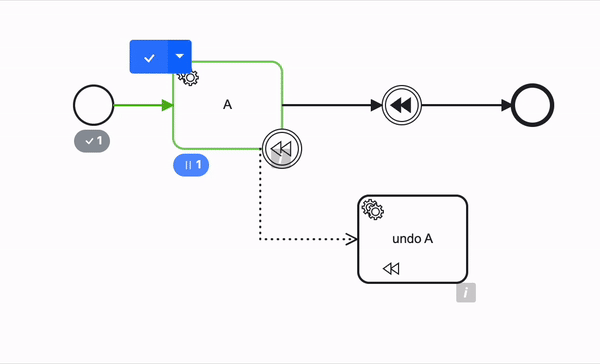
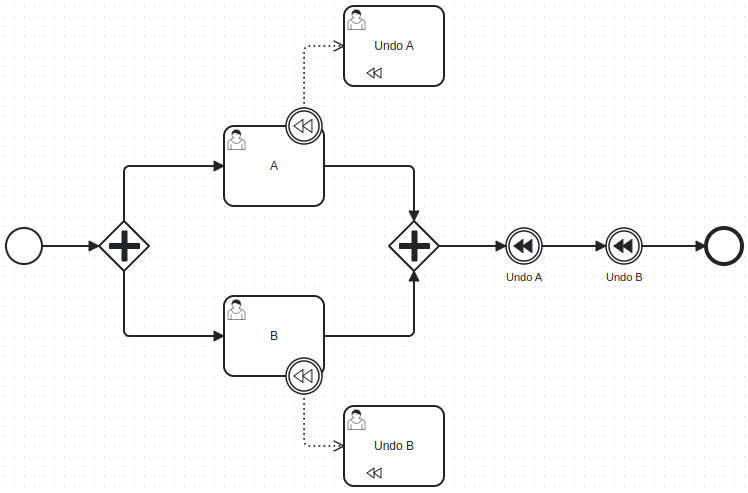
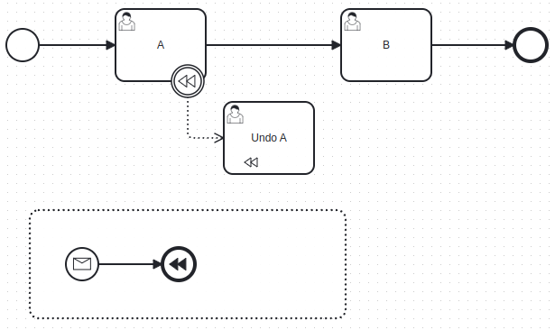
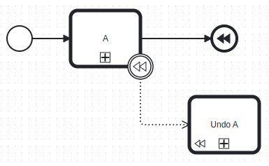
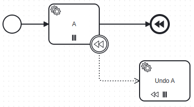
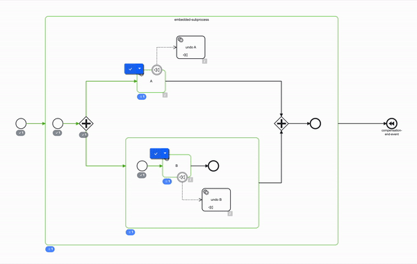

Compensation events are concerned with undoing steps that were already successfully completed, because their results and
possibly side effects are no longer desired and need to be reversed.



The example above shows the execution of a compensation event:

- The process reaches the `compensation intermediate throw` event after the `service task` activity is completed
- This trigger the compensation handler attached to the activity
- Once the compensation handler is completed, the process reach the `end event`

## Defining a compensation

A compensation event is of three kind:

- Boundary event
- Throw event
- End event

The compensation boundary event must be attached to one of the following type of [activities](/components/modeler/bpmn/tasks.md):

- Service Tasks
- User Tasks
- Send Tasks
- Script Tasks
- Manual Tasks
- Undefined Tasks

By default, a compensation intermediate throw or end event triggers the compensation within its scope. If the compensation throw event is on the process level then it invokes all compensation handlers of the process.

## Compensation for the scope vs. for a given activity

Besides the broadcasting of the compensation event, a compensation throw event can trigger the compensation for a specific activity. Triggering the compensation for a specific activity can be used to enforce that compensation handlers are invoked synchronously in a given order.



On a compensation intermediate throw or end event, it is possible to specify the activity to compensate by using the property `activityRef`. The referenced activity must have a compensation boundary event and must be in the same scope of the compensation throw event.

## Compensation from an event subprocess

An interrupting or non-interrupting event subprocess can contain compensation intermediate throw events or a compensation end event. These compensation events can specify an activity or broadcast the compensation in the parent scope of the event subprocess. If the compensation throw event specifies an activity and the activity is completed then it invoke only the compensation handler of this activity.



A common pattern is to use this in combination with an error event subprocess to undo activities if a failure occurs that can't be recovered from.

## Compensation handlers

Compensation handlers are activities or subprocesses attached to other activities using a `compensation boundary event`. When the process reaches a compensation throw event, it triggers the compensation handlers. If the compensation activity has been completed more than once, the compensation handler is invoked for the same amount.

If the compensation handler has input variable mappings, those are applied before invoking the compensation handler. At the same way, if the compensation handler has output variable mappings, those are applied after invoking the compensation handler

### Embedded subprocess as compensation handler


The subprocess contains the steps to undo the actions of the compensation activity. Using a subprocess can be useful if a sequence of steps is required to undo the actions of the activity.

### Call activity as compensation handler



The call activity contains the steps to undo the actions of the compensation activity. Using a call activity can be useful in combination with a call activity as the compensation activity since compensation is not propagated to the child process.

### Multi instance activity as compensation handler



The multi-instance activity can be marked as sequential or parallel and defines an input collection. Using a multi-instance activity can be useful in combination with a multi-instance activity as the compensation activity since a compensation handler for a multi-instance activity is invoked only once and not for each item of the input collection.

## Embedded subprocess

When a process instance enters a compensation intermediate throw or end event, it triggers the compensation of the current scope and invokes the compensation handlers of completed activities.

After the current scope, it triggers the compensation for the child scopes recursively. As a result, it should invoke the compensation handlers in completed [embedded subprocesses](/components/modeler/bpmn/embedded-subprocesses/embedded-subprocesses.md). If a subprocess is not completed (i.e. still active or terminated), the compensation handlers within the subprocess should not be invoked.



:::info
If the subprocess is interrupted, all the compensation handlers within the subprocess can't be invoked anymore. This can be relevant to long-living processes.
:::

## Multi instance activity

When a process instance enters a compensation intermediate throw or end event, it triggers the compensation and invokes the compensation handlers of completed activities.

If an activity is a multi-instance activity or multi-instance subprocess, the compensation handler is invoked once. The compensation handler is responsible for compensating the effect of all instances of the multi-instance activity.

The compensation handler is invoked if all instances of the multi-instance activity are completed.


## Additional resources

### XML representation

A intermediate compensation throw event with referenced activity:

```xml
<intermediateThrowEvent id="CompensationThrowEvent">
    <incoming>Flow_0b2blc2</incoming>
    <outgoing>Flow_1goayj7</outgoing>
    <compensateEventDefinition id="CompensateEventDefinition_1afu1vn" activityRef="Task_A" />
</intermediateThrowEvent>
```
